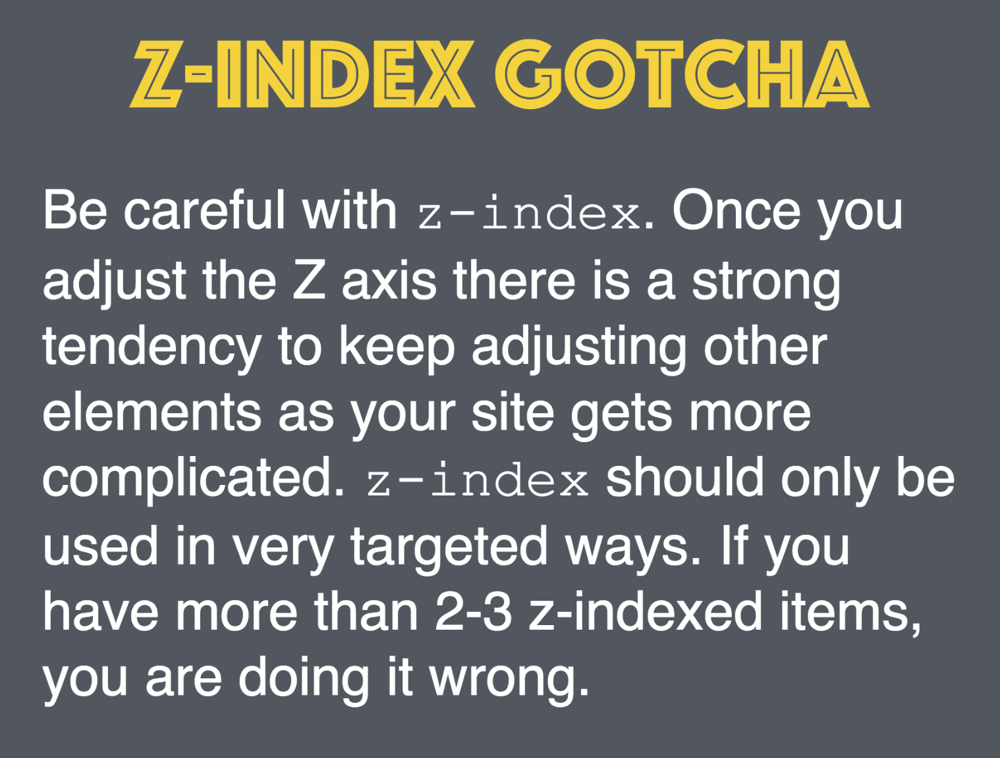

# CSS Position

### [View Codepen Example of Position Relative](https://codepen.io/MicFin/pen/ZWzxWx)

### [View Codepen Example of Position Absolute](https://codepen.io/MicFin/pen/grYeMP)

### [View Codepen Example of Position Fixed](https://codepen.io/MicFin/pen/bpbveg)

## CSS Position Ice Cream

- [Read this article](https://medium.freecodecamp.org/css-positioning-explained-by-building-an-ice-cream-sundae-831cb884bfa9)

- [Complete this exercise](https://www.codeanalogies.com/csssundae)

## Lab

A hot, new NY Tech Startup, Relaxr, has approached you to help them develop a new landing page for their company. They've handed you the for the site, along with the copy and assets. You need to take these files and turn it into a landing page.

[Click here for more details about our Relaxr client's website!](exercise/README.md)

## Homework

Relaxr was really impressed by your work last week and wants you to continue development on their landing page. Starting in class, you will work to build out a more complex layout for their company site. They decided on creating a blog, and their back-end engineers will be focused on developing the blog's functionality. They want your front-end skills to style their designs using HTML and CSS so Relaxr's engineers can begin integrating. 

[Click here for more details about our Relaxr client's blog website!](homework/README.md)

## Additional Resources

- https://cssreference.io/positioning/
- https://internetingishard.com/html-and-css/advanced-positioning/
- http://learnlayout.com/toc.html